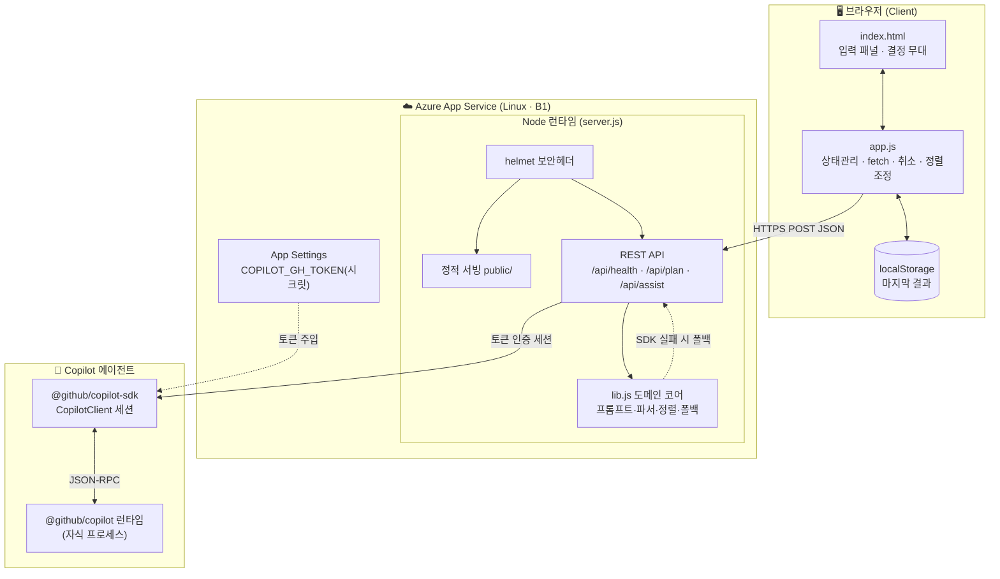
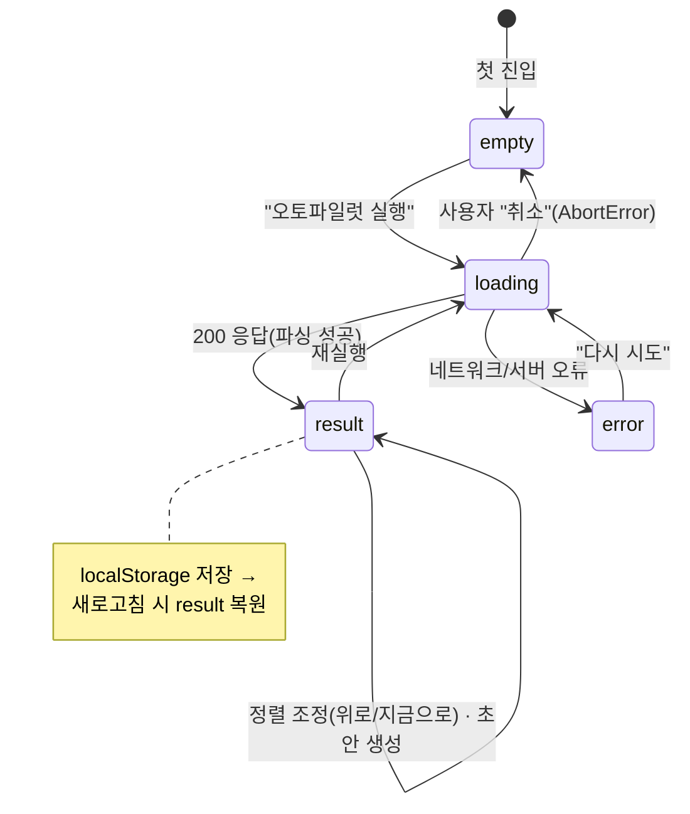

# 02. 아키텍처 · 와이어프레임

> 시스템이 **어떻게 생겼고**, 화면 컴포넌트가 **어떻게 배치**되는지.

---

## 1. 시스템 아키텍처 (컴포넌트 다이어그램)



**핵심 설계 포인트**
- **단일 서비스**: 프런트(정적)와 API가 한 Node 프로세스에 공존 → 배포 단위 1개.
- **AI는 곁가지**: `/api/plan`은 우선 SDK를 시도하고, 실패하면 `lib.js`의 결정적 폴백으로 자연 전환 → **AI가 죽어도 앱은 산다**.
- **시크릿 격리**: 토큰은 코드가 아니라 App Settings에서 환경변수로 주입.

---

## 2. 화면 와이어프레임 (데스크톱)

```
┌──────────────────────────────────────────────────────────────────────┐
│ ● Oh-My-DayAuto    쏟아내면 오늘의 결정 하나        ● 서버 정상·토큰인증 │  ← topbar
├───────────────────────────────┬──────────────────────────────────────┤
│ [입력 패널]  (sticky)          │ [결정 무대]                          │
│                                │                                      │
│ 오늘의 맥락을 그냥 쏟아내세요   │  에이전트 브리핑      [Copilot SDK]🟢│  ← 출처 배지
│ ┌────────────────────────────┐ │ ┌──────────────────────────────────┐ │
│ │ 분기 보고서 마감            │ │ │ 5 결정  1 초안  약 75분 절약      │ │  ← 증폭 미터
│ │ 고객사 회신 메일            │ │ ├──────────────────────────────────┤ │
│ │ 저녁 운동                   │ │ │ ↕ 입력 순서가 아니라 마감·영향... │ │  ← orderRationale(투명성)
│ │ 언젠가 사이드 프로젝트      │ │ ├──────────────────────────────────┤ │
│ └────────────────────────────┘ │ │ 지금, 이거 하나                   │ │  ← 히어로(단 하나)
│                                │ │ [지금 바로] 분기 보고서 마감       │ │
│ [오토파일럿 실행][예시][비우기]│ │  └ 마감·영향이 가장 큼            │ │
│                                │ │  [이 작업 초안 만들기]            │ │
│ 한 번 입력 → 약 10~30초 안에   │ ├──────────────────────────────────┤ │
│ 오늘의 결정 1개 + 타임라인     │ │ 남은 결정      ↑위로 · 지금으로   │ │  ← 사용자 통제
│                                │ │ 2 [오늘 안에] 고객사 회신 메일    │ │
│ 1 입력 → 2 결정 → 3 작업물생성 │ │ 3 [미루기]   세금 서류           │ │
│                                │ │ 4 [버리기]   ~~사이드 프로젝트~~  │ │  ← 취소선
│                                │ ├──────────────────────────────────┤ │
│                                │ │ 지금부터 흐름 (타임라인)          │ │
│                                │ │ 15:00–16:20  분기 보고서 작성     │ │  ← 현재시각 기준
│                                │ │ 16:30–17:00  고객사 회신          │ │
│                                │ └──────────────────────────────────┘ │
├───────────────────────────────┴──────────────────────────────────────┤
│ 개인 생산성 향상 웹앱 · Copilot SDK 에이전트 · Azure                   │  ← footer
└──────────────────────────────────────────────────────────────────────┘
```

### 로딩 중 상태 (취소 가능)

```
┌──────────────────────────────────────┐
│ 에이전트가 오늘을 운영하는 중…        │
│   ● 맥락 분석            (done)       │  ← 단계형 진행 표시
│   ◔ 우선순위 결정        (on)         │
│   ○ 타임라인·작업물 생성              │
│            [ 취소 ]                   │  ← AbortController
└──────────────────────────────────────┘
```

---

## 3. 반응형 거동

| 폭 | 레이아웃 |
| --- | --- |
| **≥ 960px** (데스크톱) | 좌(입력)·우(결정 무대) 2단. 입력 패널 `sticky`. |
| **560–960px** (태블릿) | 1단 세로 스택. 입력 → 결과 순. |
| **< 560px** (모바일) | 결정 카드가 `rank → chip → body → 컨트롤` 세로 재배치. 버튼 풀폭. |

---

## 4. 화면 상태 머신 (UX State)



> 4개 상태(empty·loading·error·result)는 `[hidden]` 속성으로 **상호 배타** 렌더링.
