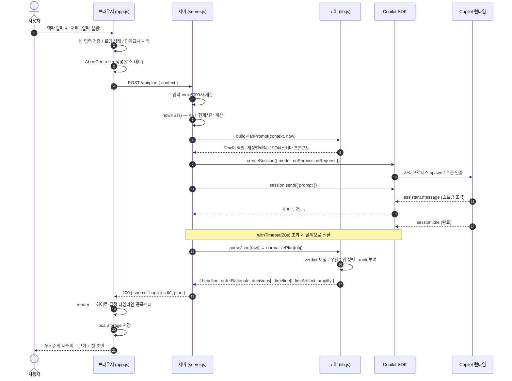
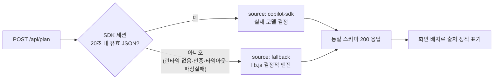
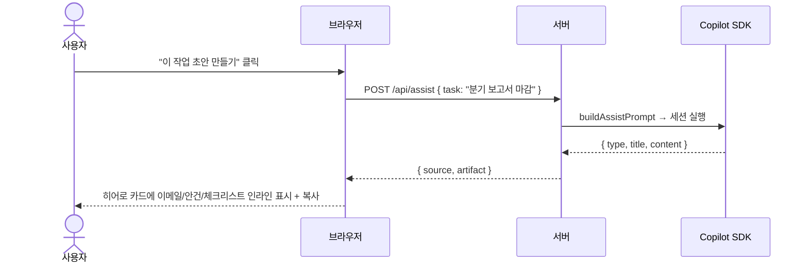

# 03. 서비스 플로우 (End-to-End)

> 사용자가 입력창에 텍스트를 넣고 "오토파일럿 실행"을 누른 순간부터, 화면에 우선순위 나래비가 그려지기까지 **시간 순서로** 무엇이 일어나는가.

---

## 1. 전체 시퀀스 다이어그램



---

## 2. 단계별 상세 (요청 1건의 생애)

### ① 클라이언트 전처리 (`app.js` `runPlan`)
1. `context.trim()` → 비어 있으면 "맥락을 적어주세요" 후 중단.
2. 버튼 비활성화, 상태를 `loading`으로, **단계 표시** 시작(맥락 분석 → 우선순위 결정 → 생성).
3. `new AbortController()` 생성 → **취소 버튼**이 이 시그널을 끊는다.
4. `fetch("/api/plan", { signal })`.

### ② 서버 입력 가드 (`server.js`)
1. `context ?? text`에서 문자열 추출 → `trim().slice(0, 6000)`(MAX_INPUT).
2. 빈 입력 → `400 { error:"EMPTY_INPUT" }`.
3. `nowKST()` — Azure 호스트가 UTC이므로 `Intl.DateTimeFormat("Asia/Seoul")`로 KST 시각을 계산(타임라인 기준점).

### ③ 프롬프트 구성 (`lib.js` `buildPlanPrompt`)
- 역할 고정: *"당신은 사용자의 오토파일럿 에이전트. 정리가 아니라 결정을 내려라."*
- **재정렬 원칙 주입**: "입력 순서를 따르지 말고 마감·영향·시간민감도·타인의존도로 정하라. 적어도 하나는 DEFER/DROP/DELEGATE로 덜어내라."
- 현재 시각 주입: "지금은 오후 3:00. 모든 시간은 지금 이후로."
- 출력 형식 고정: 코드펜스·인사말 없이 **JSON 스키마만**.

### ④ AI 세션 실행 (`server.js` `runAgent`)
```
getClient() → CopilotClient(토큰) → start()        // 최초 1회, 이후 재사용
createSession({ model:"auto", onPermissionRequest: scopedPermission })
session.on("assistant.message", e => buffer += e.data.content)   // 스트림 누적
session.on("session.idle", () => resolve())                      // 완료 신호
session.send({ prompt })
withTimeout(buffer완료, 20000ms)                                 // 타임아웃 가드
session.disconnect()                                             // 정리
```
- **권한 게이트(`scopedPermission`)**: 런타임이 셸/파일/URL/MCP 권한을 요청하면 **거부**, 무해한 요청만 1회 승인 → 프롬프트 주입 방어.

### ⑤ 파싱 · 정규화 · 정렬 (`lib.js`)
- `parseJson`: 코드펜스 제거 → 첫 `{`~마지막 `}` 추출 → `JSON.parse`(실패 시 `null`).
- `normalizePlan`: 타입 검증, 잘못된 verdict → `SCHEDULE`로 보정, **VERDICT_RANK로 안정 정렬 + rank 부여**(상세는 [04 문서](04-우선순위엔진.md)).
- 파싱이 `null`이면 → **폴백 경로**로 던진다.

### ⑥ 응답 · 렌더
- 성공: `{ source:"copilot-sdk", plan }`.
- 클라이언트가 히어로(지금 이거 하나) → 남은 결정 → 타임라인 → 증폭 미터 순으로 그린다.
- `localStorage`에 저장 → 새로고침 후 복원.

---

## 3. 분기: 정상(SDK) vs 폴백(오프라인)



> **설계 의도**: 두 경로가 **완전히 같은 JSON 스키마**를 반환한다. 그래서 프런트는 출처와 무관하게 동일하게 렌더하고, 사용자에겐 배지로만 구분을 알린다. → "데모가 절대 깨지지 않는다 + 거짓말하지 않는다".

---

## 4. 멀티스텝: "이 작업 초안 만들기" (`/api/assist`)

`/api/plan`으로 결정을 받은 뒤, 사용자가 1순위 작업의 **초안 생성**을 누르면 두 번째 에이전트 호출이 일어난다.



> `type`(이메일/회의안건/체크리스트/개요/메시지)은 작업 텍스트의 키워드로 추론하거나 사용자가 지정. 이 2단 호출이 "단일 프롬프트"를 넘어선 **멀티스텝 워크플로**의 근거.
