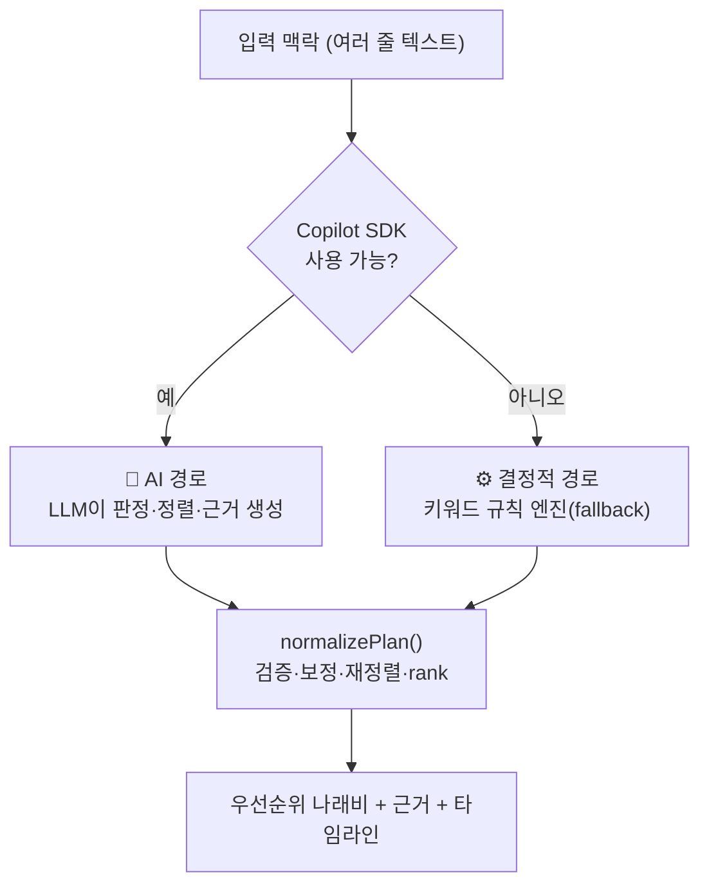

# 04. 우선순위 엔진 — "나래비"는 어떻게 만들어지는가 (핵심)

> 사용자가 텍스트를 넣으면, 백엔드가 **어떤 규칙으로 순서를 매겨** 우선순위 나래비(줄세우기)를 만드는지 단계별로 해부한다.
> 이 문서가 Oh-My-DayAuto의 **두뇌**다.

---

## 0. 핵심 원칙 — "입력 순서 ≠ 우선순위"

대부분의 To-Do 앱은 **사용자가 적은 순서**대로 보여준다. Oh-My-DayAuto는 **일부러 그러지 않는다.**

> 우선순위는 **마감 임박 · 영향 범위 · 시간 민감도 · 타인 의존도**로 다시 매긴다.
> 그리고 *"왜 이 순서인지"*(`orderRationale`)를 **반드시 화면에 노출**해 신뢰를 만든다.

이 한 줄이 제품의 정체성이자, 심사가 "투명성 UX"로 호평한 지점이다.

---

## 1. 판정 체계 (Verdict) — 5단계 결정

모든 항목은 5개 판정 중 하나를 받는다. 단순 "할 일/안 할 일"이 아니라 **결정을 대행**한다.

| Verdict | 한국어 | 의미 | 정렬 순위(RANK) | 화면 색 |
| --- | --- | --- | --- | --- |
| `DO_NOW` | 지금 바로 | 마감·영향 최대, 즉시 착수 | **0** (최상단) | 레드(강조) |
| `SCHEDULE` | 오늘 안에 | 오늘 시간블록에 배치 | 1 | 인디고 |
| `DELEGATE` | 위임 | 타인이 더 잘/빠르게 | 2 | 그린 |
| `DEFER` | 미루기 | 지금 안 해도 손실 적음 | 3 | 뉴트럴 |
| `DROP` | 버리기 | 가치 대비 비용 낮음 → 제거 | 4 (최하단) | 흐림+취소선 |

```js
const VERDICT_RANK = { DO_NOW: 0, SCHEDULE: 1, DELEGATE: 2, DEFER: 3, DROP: 4 };
```

> **설계 의도**: "적어도 하나는 덜어내라(DEFER/DROP/DELEGATE)"를 프롬프트에 강제. 결정 비용을 줄이려면 **무엇을 안 할지** 정하는 게 핵심이기 때문.

---

## 2. 두 갈래의 두뇌: AI 경로 vs 결정적 경로

우선순위는 **두 가지 엔진** 중 하나가 만든다. 출력 스키마는 동일하다.



---

## 3. AI 경로 — LLM이 판정한다

### 3-1. 프롬프트가 LLM에게 시키는 것 (`buildPlanPrompt`)
- **역할**: "정리가 아니라 결정을 단호히 내리는 에이전트."
- **재정렬 규칙**: "입력 순서를 따르지 말 것. 마감·영향·시간민감도·타인의존도 기준. 적어도 하나는 덜어낼 것."
- **현재 시각 주입**: "지금은 오후 3:00 → 모든 시간은 이후로."
- **출력 계약**: 아래 JSON만(설명·코드펜스 금지).

```json
{
  "headline": "오늘의 한 줄 전략",
  "orderRationale": "입력 순서가 아니라 무엇을 기준으로 정렬했는지(1~2문장)",
  "decisions": [{ "item": "...", "verdict": "DO_NOW", "why": "한 문장", "when": "시간대" }],
  "timeline": [{ "time": "15:00–16:20", "block": "무엇을", "focus": "왜" }],
  "firstArtifact": { "forItem": "...", "type": "email", "title": "...", "content": "..." },
  "amplify": { "decisionsMade": 5, "artifactsDrafted": 1, "minutesSaved": 75 }
}
```

### 3-2. 세션 실행 (`runAgent`)
스트리밍 조각(`assistant.message`)을 버퍼에 모으고 `session.idle`에서 완료 → `withTimeout(20s)`로 무한대기 차단.

---

## 4. 결정적 경로 — AI 없이도 줄을 세운다 (`fallbackPlan`)

> SDK가 없거나 실패해도 **똑같이 유용한** 결과를 내기 위한 순수 규칙 엔진. 단위 테스트로 동작 보장.

### 4-1. 한 줄씩 판정 추론 (`inferVerdict`) — 우선순위 규칙

키워드 신호를 **위치보다 먼저** 본다(입력 순서 의존 최소화).

```js
function inferVerdict(line, idx) {
  if (DELEGATE_HINTS.some(h => line.includes(h))) return "DELEGATE"; // 부탁·요청·위임·맡기
  if (DROP_HINTS.some(h => line.includes(h)))     return "DROP";     // 언젠가·나중에·구경·심심
  if (URGENT_HINTS.some(h => line.includes(h)))   return "DO_NOW";   // 마감·오늘·긴급·회신·제출
  if (MEETING_HINTS.some(h => line.includes(h)))  return "SCHEDULE"; // 회의·미팅·발표·보고
  if (idx === 0) return "DO_NOW";   // 신호 없으면 첫 줄만 즉시
  if (idx <= 2)  return "SCHEDULE"; // 상위 → 오늘 안에
  return "DEFER";                   // 나머지 → 미루기
}
```

| 신호 그룹 | 키워드(일부) | → 판정 |
| --- | --- | --- |
| URGENT | 마감, 오늘, 긴급, 데드라인, 제출, 회신, 답장 | DO_NOW |
| DELEGATE | 부탁, 요청, 위임, 대신, 맡기, 전달받 | DELEGATE |
| DROP | 언젠가, 나중에, 아이디어, 구경, 심심 | DROP |
| MEETING | 회의, 미팅, 발표, 보고, 킥오프 | SCHEDULE |

### 4-2. 타임라인 생성 — 현재 시각 기준 (고정 슬롯 X)
- `DO_NOW`/`SCHEDULE` 항목만 골라, **`nowKST()` 이후**로 60·45·60·30분 블록을 순차 배치.
- ❌ 과거에 있던 "고정 09:00 시작" 버그 제거 → 오후 3시에 쓰면 15:00부터 시작.

---

## 5. 공통 정규화·정렬 (`normalizePlan` → `sortAndRank`)

**AI든 폴백이든** 마지막엔 같은 정규화를 거친다. 여기서 최종 "나래비"가 확정된다.

```js
function sortAndRank(decisions) {
  return decisions
    .map((d, i) => ({ d, i }))                 // 원래 위치 보존
    .sort((a, b) => {
      const ra = VERDICT_RANK[a.d.verdict] ?? 9;
      const rb = VERDICT_RANK[b.d.verdict] ?? 9;
      return ra - rb || a.i - b.i;             // ① verdict 순위 ② 동순위면 입력순(안정정렬)
    })
    .map(({ d }, idx) => ({ ...d, rank: idx + 1 })); // 1,2,3… 표시 순번 부여
}
```

정규화가 하는 일(MECE):
1. **타입 검증**: `item` 없는 항목 제거, 최대 10개로 컷.
2. **verdict 보정**: 스키마 밖 값(LLM 오타 등) → `SCHEDULE`로 안전 치환.
3. **정렬**: `VERDICT_RANK` 오름차순 → DO_NOW가 항상 맨 위, DROP이 맨 아래.
4. **안정성**: 같은 판정끼리는 **입력 순서 유지**(예측 가능성).
5. **rank 부여**: 화면 표시 순번(1·2·3…).
6. **기본값 채움**: `orderRationale`/`headline`이 비면 안전한 한국어 기본 문구.

---

## 6. 워크드 예시 (입력 뒤섞어도 올바르게 줄세움)

**입력** (일부러 중요도 역순으로):
```
저녁에 운동 30분
언젠가 사이드 프로젝트 구경
고객사에 회신 메일 보내기
분기 보고서 초안 쓰기(오늘 마감)
세금 서류 확인
```

**엔진 처리**:
| 입력 위치 | 항목 | 신호 | verdict | RANK |
| --- | --- | --- | --- | --- |
| 4 | 분기 보고서(오늘 마감) | 마감/오늘 → URGENT | DO_NOW | 0 |
| 3 | 고객사 회신 메일 | 회신 → URGENT | DO_NOW | 0 |
| 5 | 세금 서류 확인 | (신호 없음, idx 큼) | DEFER | 3 |
| 1 | 저녁 운동 | (신호 없음) | DEFER/SCHEDULE | 3 |
| 2 | 언젠가 사이드 | 언젠가 → DROP | DROP | 4 |

**출력 나래비** (rank 순):
```
1. [지금 바로] 분기 보고서 초안 쓰기(오늘 마감)
2. [지금 바로] 고객사에 회신 메일 보내기
3. [미루기]   세금 서류 확인
4. [미루기]   저녁에 운동 30분
5. [버리기]   ~~언젠가 사이드 프로젝트 구경~~

▶ orderRationale: "입력 순서가 아니라 오늘 마감과 외부 영향이 큰 일을 앞에 두고,
   가치가 낮은 항목은 제거해 결정 비용을 줄였습니다."
```

> 4번으로 적은 "마감" 항목이 1위로, 1번으로 적은 "운동"이 4위로 내려갔다. **이것이 "결정 대행"의 증거.**

---

## 7. 사용자 통제권 (엔진 위의 사람)

엔진이 정한 순서를 사용자가 **덮어쓸 수 있다**(클라이언트 상태만 변경, 서버 재호출 없음):

| 컨트롤 | 동작 |
| --- | --- |
| **↑ 위로** | 해당 결정을 표시 순서에서 한 칸 위로(`moveUp`). 1위가 되면 히어로 교체. |
| **지금으로** | 맨 위로 끌어올림(`promote`) → 히어로가 그 항목으로 바뀌고 초안 재생성 유도. |
| **펼치기** | 결정의 "왜"(근거)를 접고/펼침. |

> AI의 판단은 **제안**이고 최종 결정권은 사람에게 — 책임 있는 AI 설계.

---

## 8. 증폭 미터 (`amplify`) — 효과의 가시화

| 지표 | 계산(폴백 기본값) | 의미 |
| --- | --- | --- |
| `decisionsMade` | 결정 항목 수 | 대신 내려준 결정 |
| `artifactsDrafted` | 첫 초안 있으면 1 | 생성한 작업물 |
| `minutesSaved` | `결정수 × 4 + (초안 있으면 12)` | 추정 절약 시간(분) |

> AI 응답이 값을 주면 그것을, 없으면 위 공식으로 보정. "수동 정리 5~10분 → 1회 입력 수십 초"의 정량 메시지를 뒷받침.
