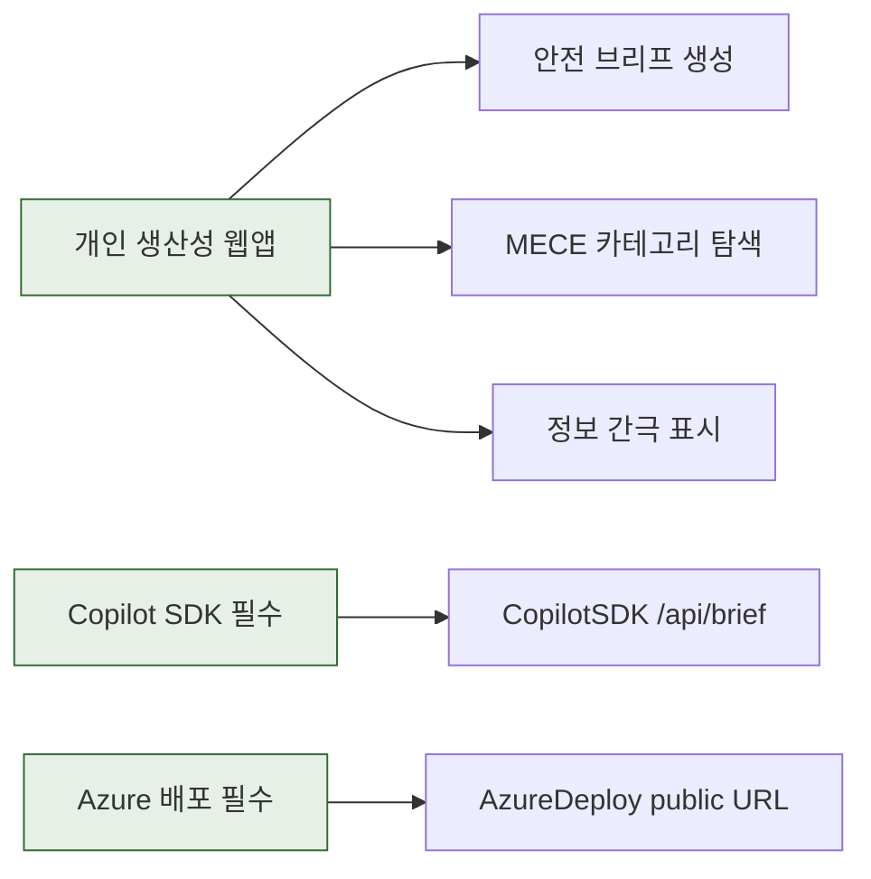
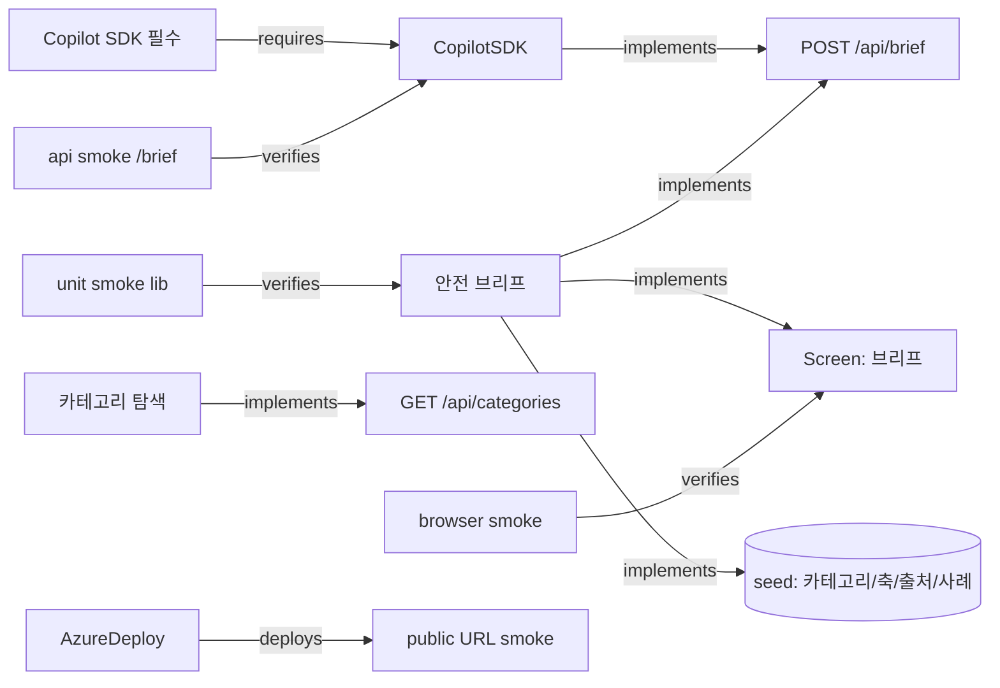

# 30 Trace Graph — 안심육아 브리프

Confidence: `EXTRACTED`=공식/관찰, `INFERRED`=합리적 추론, `AMBIGUOUS`=확인 필요.

## Requirement Graph



## Product Graph (feature -> persona/pain)

```mermaid
graph LR
  P[초보 부모]:::p
  PAIN[조사시간·불안·정보간극으로 결정 불가]:::pain
  F1[안전 브리프 생성] -->|serves| PAIN
  F1 -->|serves| P
  F2[MECE 카테고리 탐색] -->|serves| P
  F3[정보 간극 표시] -->|serves| PAIN
  classDef p fill:#e0ebf0,stroke:#2f5a6b; classDef pain fill:#f3ddd5,stroke:#c5462e;
```

## Implementation Trace Graph



## Risk / Decision Graph

```mermaid
graph LR
  R1[Azure SDK 미동작]:::risk -->|blocks| DEP[AzureDeploy]
  D_FB[Decision: fallback 근거엔진]:::dec -->|resolves| R1
  R2[JSON 파싱 불안정]:::risk -->|blocks| F1[안전 브리프]
  D_PARSE[Decision: robust parser + normalizeBrief]:::dec -->|resolves| R2
  R3[의학 오정보]:::risk -->|blocks| F1
  D_HONEST[Decision: 날조 금지 + 정보간극/출처확인 + 면책]:::dec -->|resolves| R3
  V1[비전: 실시간 인증/회수 연동]:::vis
  D_DEFER[Decision: 실시간 조회 DEFER]:::dec -->|defers| V1
  classDef risk fill:#faf0ec,stroke:#c5462e; classDef dec fill:#e7f0e7,stroke:#2f6b34; classDef vis fill:#f6ecd6,stroke:#8a5a13;
```

## Graph Lint (pass conditions)

- [x] kept feature(F1)에 `verifies` 엣지 존재(SMOKE1/2/3).
- [x] MVP에 실제 Copilot SDK 경로 존재(/api/brief).
- [x] deploy에 smoke 경로 존재(public URL smoke).
- [x] AzureDeploy가 제출 trace에 존재.
- [x] 미해결 risk가 kept feature를 막지 않음(R1/R2/R3 모두 Decision으로 resolve).
- [x] god-node(안전 브리프 F1)가 vertical slice에 포함.
- [ ] !CONTRADICTION 없음.

## First Vertical Slice

입력(제품/우려) → `POST /api/brief`(SDK→fallback) → 구조화 브리프 렌더
(판정·연령적합성·안전축 근거·정보간극·체크리스트·출처) + `GET /api/categories` 탐색 + `GET /api/health`.
로컬 unit/api/browser smoke로 검증 가능, Azure 배포 가능.

## Kill Rules

- SDK 통합이 30분 내 로컬 응답 불가 → fallback만으로 슬라이스 확정(증거는 정직 분리).
- 카테고리 seed 확장이 smoke를 깨면 즉시 6카테고리로 동결.
- 16:30 KST 이후 신규 기능 금지(검증/문서/배포만).

## Next

1. lib.js(seed+prompt+parse+fallback) → 2. server.js(API) → 3. public/(UI) → 4. smoke → 5. Azure.
