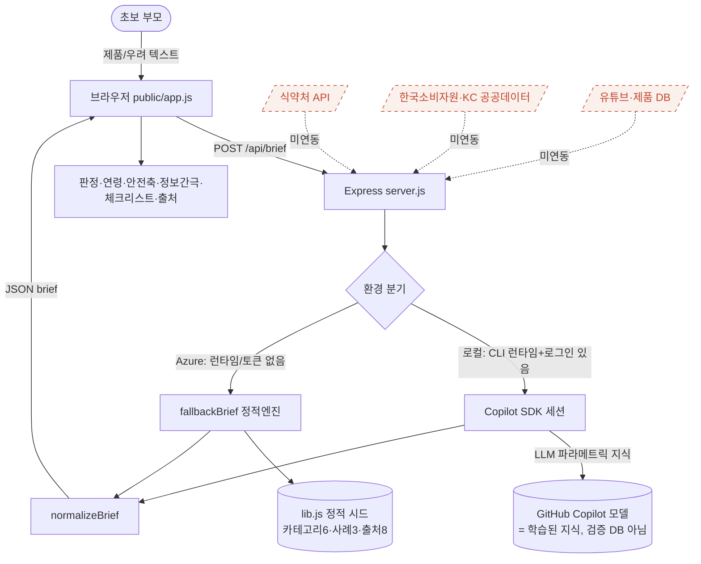
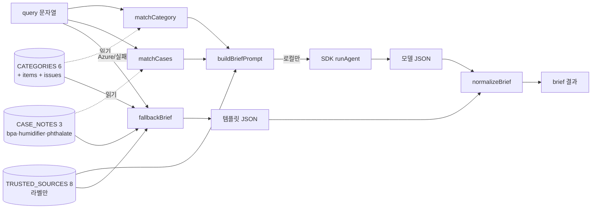

# 데이터 흐름도 & 맹점 브리핑 — 안심육아 브리프

> 작성 목적: (1) "배포됐는데 작동 안 함" 진단, (2) 안전 브리프가 **데이터를 어디서 끌고
> 오는지** 흐름도, (3) 문제점·맹점 브리핑. 코드 기준(`lib.js`, `server.js`) 실측 포함.

---

## 1. 한 줄 진단

앱은 **죽지 않았습니다**(서버 200, 화면 렌더 정상). "작동 안 함"처럼 보이는 이유는 둘:

1. **Azure에서는 설계상 AI(Copilot SDK)가 동작하지 않고 항상 fallback(오프라인 엔진)으로 대체됨.**
   → 매번 "Copilot SDK 미연결" 배지 + 빈약한 결과 → "AI가 안 돈다"는 인상.
2. **F1 무료 플랜은 `alwaysOn=false`** → 20분 유휴 후 첫 요청이 콜드스타트로 느려짐(작동 불능처럼 보임).

그리고 "결과가 부족"한 이유: **실제 외부 데이터 출처가 0개**다. 브리프 데이터는
(a) 로컬에서만 도는 LLM의 머릿속 지식 또는 (b) `lib.js`의 작은 정적 시드뿐이다.

---

## 2. 데이터 흐름도 (현재 상태)

### 2-1. 컨텍스트 다이어그램



### 2-2. 상세 데이터 경로



---

## 3. 실제 데이터 출처 (코드 실측)

| 출처 | 무엇 | 규모 | 실재성 | 비고 |
| --- | --- | --- | --- | --- |
| `CATEGORIES` (lib.js) | 카테고리/품목/쟁점 | **6개** | 정적 하드코딩 | MECE 탐색용 |
| `CASE_NOTES` (lib.js) | 사례 메모(BPA·가습기·카시트·물티슈 등) | **10개** | 정적 하드코딩 | 키워드 매칭(확장됨) |
| `TRUSTED_SOURCES` (lib.js) | 공신력 출처 | **8개** | **이름·설명 + 공식 URL** | URL은 실제 포털, 데이터 자동조회는 아직 없음 |
| Copilot 모델(SDK) | 판정/근거 생성 | LLM 지식 | **로컬에서만 동작** | 검증 DB 아님, 환각 가능 |
| 외부 API(식약처/KC/소비자원/유튜브) | 인증·회수·시험성적 | **0개** | **미연동** | `fetch`/`https` 자동호출 0건 |

> 핵심: 앱이 내세우는 "공신력 근거"는 **실제로 그 기관에서 데이터를 가져오는 게 아니라,
> '거기서 확인하라'고 가리키는 정적 라벨**이다. 진짜 근거 retrieval은 없다.

---

## 4. "데이터 부족" 실증 (Azure 응답 비교)

| 질의 | 시드 매칭 | source | 결과 두께(ev/gaps/check/alt) |
| --- | --- | --- | --- |
| 필립스 아벤트 쪽쪽이 비스페놀A | ✅ bpa | fallback | 3 / 3 / 4 / 0 (풍부) |
| 가습기 살균제 | ✅ humidifier | fallback | 2 / 2 / 3 / 2 (경고+대안) |
| 유모차 안전한 제품 | ✖ | fallback | 2 / 1 / 4 / 0 (generic) |
| 아기 카시트 추천 | ✖ | fallback | 2 / 1 / 4 / 0 (generic·추천 불가) |
| 베이비파우더 | ✖(품목 없음) | fallback | INSUFFICIENT, 카테고리 없음 |

→ 시드 3개 사례 밖의 질의는 **거의 동일한 템플릿**으로 수렴. "추천"은 제품 데이터가 없어 불가능.

---

## 5. 문제점 · 맹점 브리핑

| # | 맹점 | 심각도 | 영향 | 해결 방향 |
| --- | --- | --- | --- | --- |
| B1 | **실제 공신력 데이터 미연동**(라벨만) | 🔴 높음 | 핵심 가치("근거") 미충족 | 식약처/소비자원/KC 공공데이터 API 연동 + 인용 링크 |
| B2 | **Azure는 항상 fallback**(SDK 미작동) | 🔴 높음 | 배포본에서 AI 부재 | `COPILOT_GH_TOKEN`+CLI 런타임 번들 또는 Azure OpenAI로 전환 |
| B3 | **LLM 환각 위험**(의학/안전 정보) | 🔴 높음 | 오정보→안전 오판 | retrieval 근거에만 기반(RAG), 미검증 시 INSUFFICIENT 강제 |
| B4 | ~~시드 3개뿐 → 대부분 generic~~ → **✅ 사례 10개로 확장** | 🟠→🟢 | 비-BPA 질의도 구체화 | (적용됨) 추가 확장 여지 |
| B5 | **F1 콜드스타트**(alwaysOn 불가) | 🟠 중간 | 첫 응답 지연=먹통 인상 | B1 SKU 승격(Always On) 또는 헬스 핑 워밍 |
| B6 | **제품 추천 불가**(제품 DB 없음) | 🟠 중간 | "추천" 질의에 무응답 | 제품 메타 DB 또는 명시적 "추천 미지원" UX |
| B7 | ~~출처 인용에 링크 없음~~ → **✅ 공식 URL 링크 부착** | 🟡→🟢 | 출처 클릭→직접 확인 | (적용됨) 딥링크 검색 쿼리는 추가 여지 |
| B8 | 토큰 미설정 상태가 사용자에게 "오류"처럼 보임 | 🟡 낮음 | 혼란 | 배지 문구를 "참고용 오프라인 모드"로 명확화 |

> **이번에 적용한 개선(B4·B7):** `CASE_NOTES` 3→10개(카시트·유모차·물티슈·로션·수면(SIDS)·
> 베이비파우더·기저귀), `TRUSTED_SOURCES`에 공식 URL + UI 클릭 링크, fallback 안전축 매핑
> 정교화. 결과적으로 비-BPA 질의도 카테고리·체크리스트·대안·출처링크가 채워짐(Azure 실측 확인).
> **남은 핵심은 B1·B2·B3** — 실제 공공데이터 retrieval + 환각 차단(정공법은 6장).

---

## 6. 권장 타깃 아키텍처 (다음 단계, 선택)

```mermaid
flowchart TD
  U([부모]) --> FE[프론트]
  FE --> API[/api/brief]
  API --> RET[Retriever]
  RET --> D1[(식약처 회수/안전정보 API)]
  RET --> D2[(소비자원 비교시험·리콜)]
  RET --> D3[(KC 인증 조회/공공데이터)]
  RET --> KB[(큐레이션 KB: 사례·체크리스트)]
  RET -->|근거 chunk| LLM[LLM 요약+판정\n근거 인용 강제]
  LLM --> CITE[인용 포함 brief]
  CITE --> FE
  note[근거 없으면 INSUFFICIENT<br/>= 환각 차단]:::n -.-> LLM
  classDef n fill:#f6ecd6,stroke:#8a5a13;
```

핵심 전환: "LLM이 아는 대로 말하기" → **"공공데이터에서 근거를 가져와 인용하고, 없으면 모른다고 하기".**
이게 B1·B3을 동시에 해결하는 정공법이다.

---

## 7. 즉시 적용 가능한 빠른 수정

- ✅ (B7) `TRUSTED_SOURCES`에 공식 URL 추가 + UI 클릭 링크 — **적용 완료**.
- ✅ (B4) `CASE_NOTES` 3→10개 확장(카시트·유모차·물티슈·로션·수면·파우더·기저귀) — **적용 완료**.
- ⬜ (B2) Azure에 `COPILOT_GH_TOKEN` App Setting 주입 → 단, SDK는 `@github/copilot` CLI 런타임을
  spawn 하므로 토큰만으로는 부족하고 런타임 번들/대체 LLM이 필요(미적용, 설계 판단 필요).
- ⬜ (B5) GitHub Actions/cron으로 `/api/health` 주기 핑 → 콜드스타트 완화(미적용).
- ⬜ (B1·B3) 공공데이터 retrieval + 인용 강제(정공법) → 별도 작업(6장).
